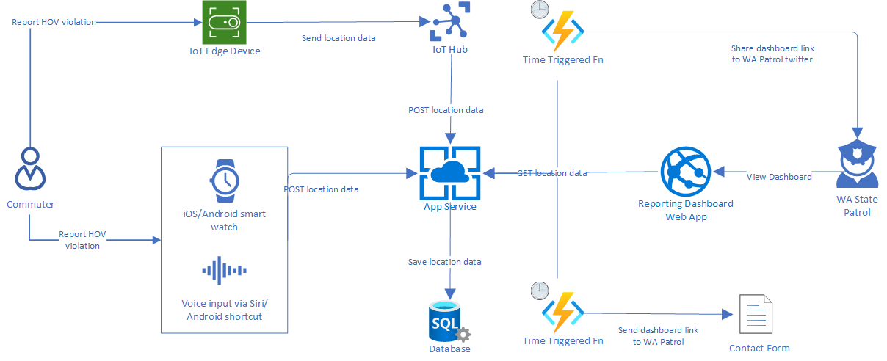

# HOV Reporter

HOV Reporter is a React Native app (Expo) that lets WA state commuters report HOV violations across state highways. The location data is aggregated anonymously into a dashboard which is shared with WA State Patrol. Currently this app is only supported in Android, it will be launched in iOS eventually. Commuters are expected to engage through voice commands that relay through the app using Action Blocks or similar mechanisms.

## Overall system architecture

